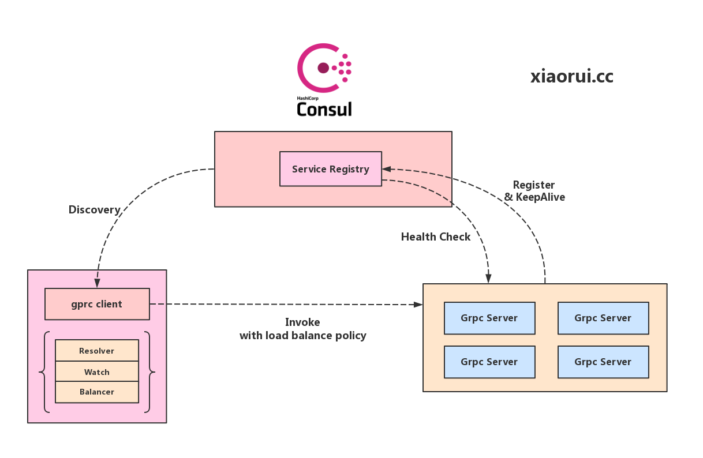
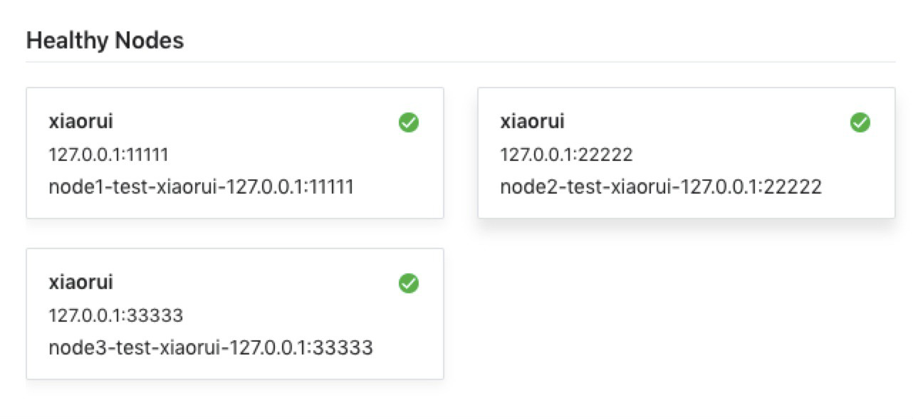

# grpclb-scheduler
This is a gRPC load balancer for go, supports Random, RoundRobin and smooth weigthed balance algo.



grpclb-schduler's some code refer to [github.com/liyue201/grpc-lb](github.com/liyue201/grpc-lb)

## Modify

* format code
* custom logger
* timeout control
* add nginx's smooth weighted round-robin balancing
* add active grpc health check
* fix consul serverEntry interface conv bug
* deincr health interval
* more ...

## Test

#### 1. start consul cluster

```
consul agent -dev
```

#### 2. start grpc server, registry node info to consul

```
cd examples/consul/server
go run main_server.go -node node1 -port 11111
go run main_server.go -node node2 -port 22222
go run main_server.go -node node3 -port 33333
```


#### 3. show available nodes 

> show on consul dashboard



**or**

> show on consul http api

```
curl -s "http://127.0.0.1:8500/v1/health/service/test?passing=true"
```

#### 4. start grpc client, discovery nodes info on consul, invoke !

```
cd examples/consul/client
go run main_client.go
```

**stdout:**

```
Hello consul, I am node1
active sleep 2s, u can stop a node

Hello consul, I am node2
active sleep 2s, u can stop a node

Hello consul, I am node3
active sleep 2s, u can stop a node

Hello consul, I am node1
active sleep 2s, u can stop a node

Hello consul, I am node2
active sleep 2s, u can stop a node

Hello consul, I am node3
active sleep 2s, u can stop a node

Hello consul, I am node1
active sleep 2s, u can stop a node

Hello consul, I am node2
active sleep 2s, u can stop a node

Hello consul, I am node3
active sleep 2s, u can stop a node

Hello consul, I am node1
active sleep 2s, u can stop a node
```